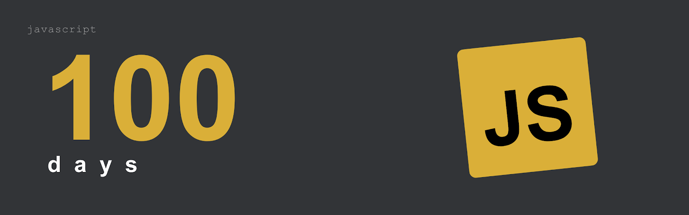

# JavaScript 100 Days



A collection of projects to improve JavaScript skills and practice HTML and CSS concepts. Each project covers different web development aspects, from basic to advanced.

## How to Run

No build step required. Open any project's `index.html` directly in a browser, or use a local server (e.g. [VS Code Live Server](https://marketplace.visualstudio.com/items?itemName=ritwickdey.LiveServer)).

## Structure

Each project lives in its own folder:

```
project-name/
├── index.html
├── style.css
└── index.js
```

## Projects

| #   | Project                                    |
| --- | ------------------------------------------ |
| 01  | [Tinder Swipe](./01-Tinder-Swipe/)         |
| 02  | [Arkanoid Game](./02-Arkanoid-Game/)       |
| 03  | [Monkeytype Clone](./03-Monkeytype-Clone/) |
